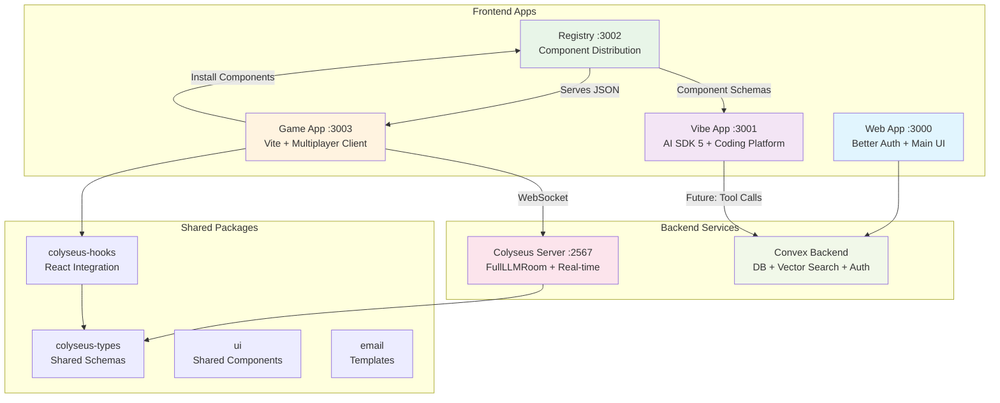

# Current Architecture Overview

## 🏗️ System Architecture (As Implemented)

## 📦 Package Structure

### Apps (User-Facing)

- **`apps/web`** - Main Next.js application with Better Auth
- **`apps/vibe`** - AI coding platform with AI SDK 5
- **`apps/registry`** - Shadcn component registry
- **`apps/game`** - Vite game client for testing components
- **`apps/server`** - Colyseus multiplayer server

### Packages (Shared)

- **`packages/backend`** - Convex backend (schema + functions)
- **`packages/colyseus-types`** - Shared Colyseus schemas
- **`packages/colyseus-hooks`** - **Publishable** React hooks for Colyseus
- **`packages/ui`** - Shared UI components
- **`packages/email`** - Email templates

## 🔧 Technology Stack

### Frontend

- **Next.js 15** - React framework for web/vibe/registry apps
- **Vite 6** - Fast build tool for game app
- **AI SDK 5** - AI orchestration and tool calling
- **React 18** - UI library with hooks
- **TypeScript** - Type safety throughout
- **Tailwind CSS** - Styling system
- **Shadcn/ui** - Component system and registry

### Backend

- **Colyseus** - Real-time multiplayer framework
- **Convex** - Database, auth, and vector search
- **Better Auth** - Authentication system
- **Node.js** - Runtime for Colyseus server

### Development

- **pnpm** - Package manager with workspaces
- **Turborepo** - Monorepo build system
- **ESM** - Modern module system throughout
- **tsup** - TypeScript build tool for packages

## 🌊 Data Flow

### Component Installation Flow

1. **Registry** serves component manifests at `/registry/[name].json`
2. **Game app** runs `shadcn add http://localhost:3002/registry/mcq-component`
3. **Components** installed with proper TypeScript types and schemas
4. **Game** imports and uses components with type safety

### Multiplayer Game Flow

1. **Game client** connects to Colyseus using `@ludiz/colyseus-hooks`
2. **Room state** synchronized via WebSocket
3. **Components** (MCQ, True/False) send events to server
4. **Server** processes game logic and broadcasts state changes
5. **All clients** update UI reactively

### AI Assistant Flow (Ready for M1)

1. **User** chats with AI in vibe app
2. **AI SDK 5** processes requests and calls tools
3. **Dynamic tools** generated from component JSON schemas
4. **Tool calls** persisted in Convex for audit trail
5. **Results** streamed back to user interface

## 🚀 Deployment Architecture

### Current (Development)

- All apps run locally on different ports
- Colyseus server on localhost:2567
- Registry serves from localhost:3002
- Game connects via environment variables

### Planned (Production)

- **Web/Vibe/Registry** → Vercel
- **Colyseus Server** → Fly.io/Railway
- **Convex** → Convex Cloud
- **Assets** → Vercel/Convex Storage

## 🔐 Security & Auth

### Current Implementation

- **Better Auth** integrated in web app
- **Environment variables** for service connections
- **Type-safe** API routes and database queries

### Planned (M1+)

- **Project-based authorization** in Convex
- **Rate limiting** for AI tool calls
- **Audit logging** for all operations
- **Component installation** tracking

## 📊 State Management

### Client State

- **React hooks** for local UI state
- **Colyseus hooks** for multiplayer state
- **AI SDK** for chat state and streaming

### Server State

- **Colyseus rooms** for real-time multiplayer
- **Convex tables** for persistent data
- **Vector embeddings** for component search

## 🧪 Testing Strategy

### Current

- **TypeScript** compilation checks
- **Build verification** for all apps
- **Manual testing** of multiplayer flow

### Planned

- **Unit tests** for shared packages
- **E2E tests** with Playwright
- **Visual regression** testing
- **Load testing** for Colyseus rooms

This architecture provides a solid foundation for the AI-driven game building platform! 🎯
